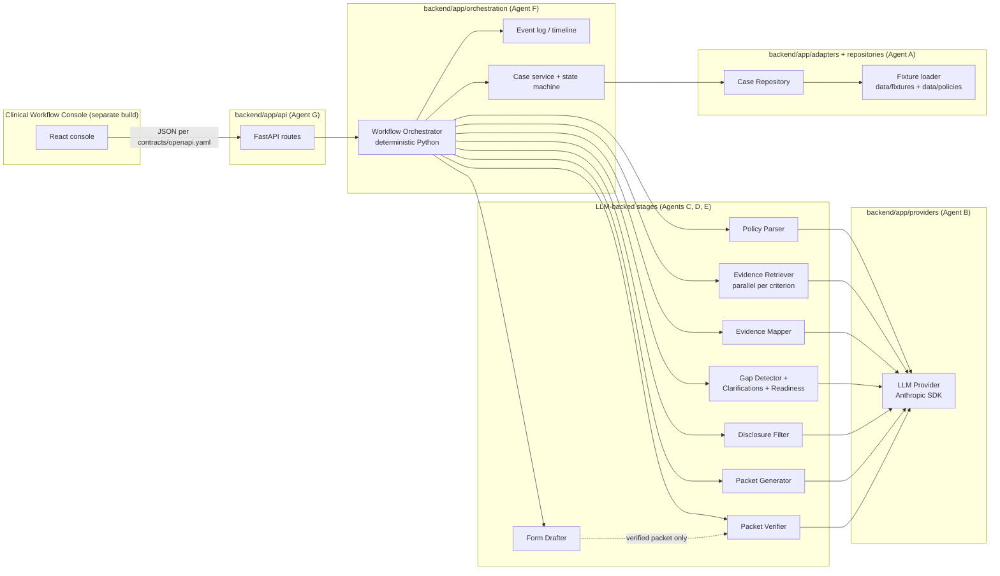
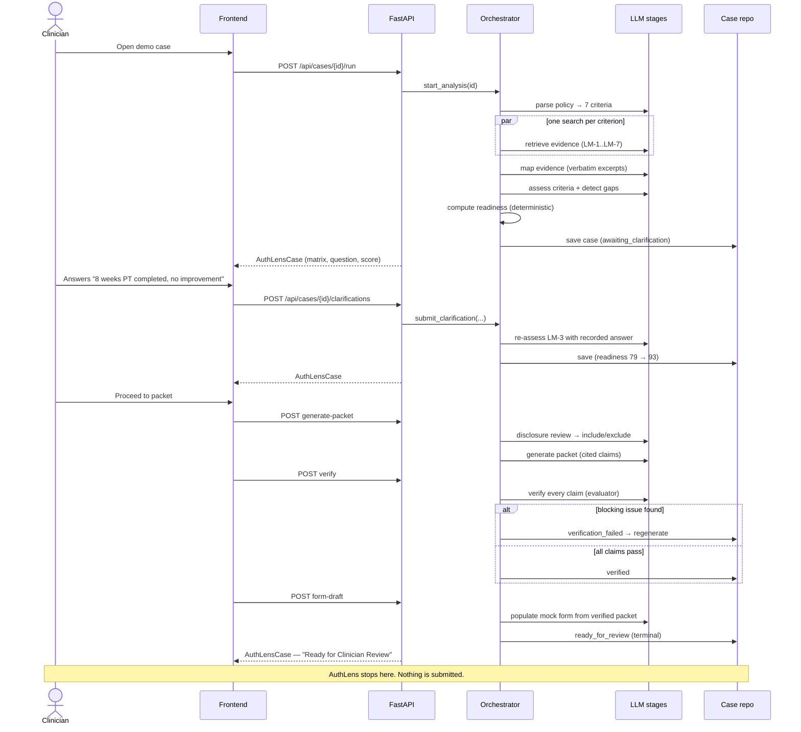
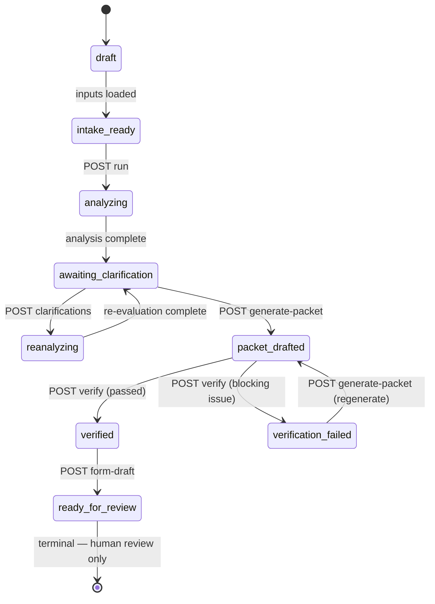
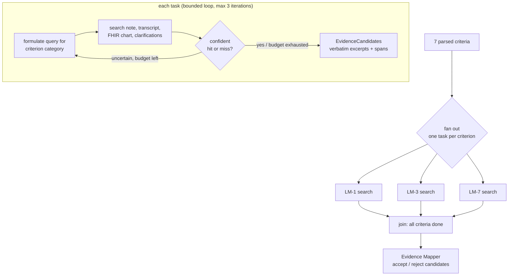
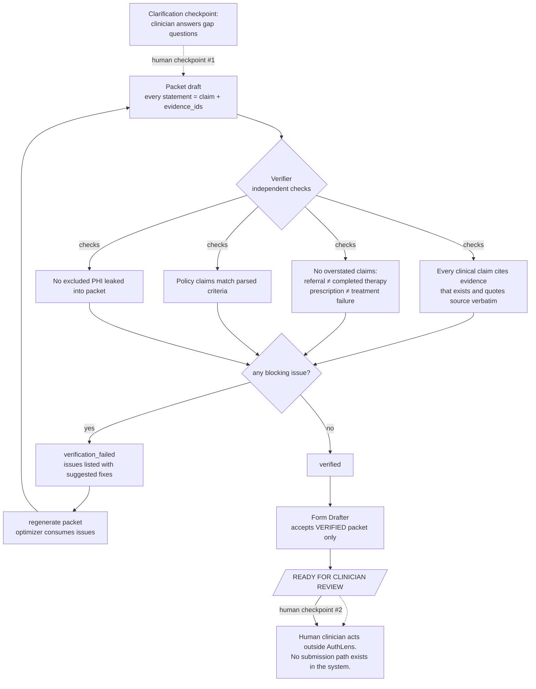

# AuthLens System Architecture

Backend-first FastAPI service. Deterministic Python orchestration calls
narrow, typed LLM stages through ports; all state is typed contracts; the
frontend renders everything from the case-state response.

Principles (per Anthropic's [Building Effective Agents](https://www.anthropic.com/engineering/building-effective-agents)):
deterministic orchestration for the overall workflow; prompt chaining for
sequential stages; routing by criterion category; parallelization for
independent chart searches; evaluator–optimizer for verification; a bounded
agent loop only for uncertain retrieval; narrow documented tools; human
checkpoints before consequential actions. Details in
[AGENT_WORKFLOWS.md](AGENT_WORKFLOWS.md).

## 1. Component architecture

The stages depend only on `app/contracts` and `app/ports` — never on each
other or on FastAPI. The orchestrator is the only component that sequences
stages and mutates case state.

## 2. Workflow sequence

## 3. Case state machine

Authoritative table: `backend/app/contracts/case.py::ALLOWED_TRANSITIONS`.
There is **no `submitted` state**; `ready_for_review` is terminal.

## 4. Parallel evidence retrieval

Retrieval fans out one bounded task per criterion; each searches all sources
independently. A criterion whose first pass is uncertain may loop — bounded
at 3 iterations — with reformulated queries before honestly returning what it
found (possibly nothing).

## 5. Verification and human-review gates

Two gates stand between analysis and the finished artifact: the machine
verification gate (evaluator–optimizer) and the human review boundary.

## Technology choices

| Concern | Choice | Rationale |
|---|---|---|
| Language / framework | Python 3.11+, FastAPI | Spec default; fast to build, typed |
| Contracts | Pydantic v2, `extra="forbid"` | Drift caught at validation time |
| LLM | Anthropic Python SDK, `claude-opus-4-8` default | Single provider port; model configurable via `AUTHLENS_ANTHROPIC_MODEL` |
| Persistence | In-memory repository | Demo scope; port allows swapping later |
| Orchestration | Plain Python in `app/orchestration` | Deterministic, testable, no LLM in control flow |
| API docs | `contracts/openapi.yaml` (hand-maintained mirror) | Frontend can codegen without running the backend |
